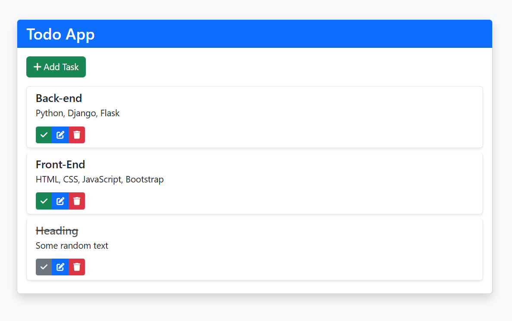
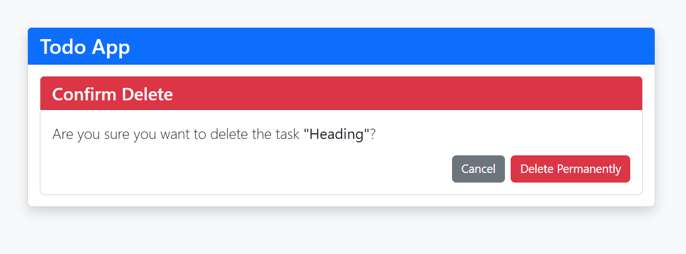

# Todo Application with Django 🚀

A beautiful and responsive Todo web application built with Django and Bootstrap 5, featuring full CRUD functionality and an intuitive user interface.

## Screenshots 📸

## Features ✨

- **Responsive Design**: Works seamlessly on all devices
- **Task Management**:

  - Add new tasks with descriptions and due dates
  - Edit existing tasks
  - Delete tasks with confirmation
  - Toggle task completion status

- **Beautiful UI**:

  - Bootstrap 5 styling
  - Font Awesome icons
  - Smooth hover animations
  - Modal forms
  - Interactive datetime picker

- **Visual Feedback**:
  - Strikethrough for completed tasks
  - Color-coded status indicators
  - Form validation errors
  - Smooth transitions

## Tech Stack ⚙️

- **Backend**: Django (Python)
- **Frontend**: Bootstrap 5, HTML5, CSS3
- **Database**: SQLite (default), easily switchable to other databases
- **Icons**: Font Awesome
- **Animations**: CSS Transitions & Hover Effects

## Installation & Setup 🚀

To get a local copy up and running, follow these steps:

- **Prerequisites**
  - Python 3.x
  - Django 4.x (or compatible version)
  - Virtual Environment (recommended)
- **Clone the repository**

  - git clone https://github.com/AlokKumar-04/ToDo-Web-Application
  - cd todo-django-app

- **Create and Activate Virtual Environment**

  - python -m venv venv

- **Apply Migrations**

  - python manage.py migrate

- **Run the Server**
  - python manage.py runserver
  - Visit http://127.0.0.1:8000/ in your browser.

## Usage 📋

- **Home Page**: Displays all tasks with their due dates and completion status.
- **Add Task**: Use the modal form to add a new task.
- **Edit Task**: Click on the edit icon to modify a task's details.
- **Delete Task**: Confirm deletion with a modal prompt.
- **Toggle Completion**: Click on the checkbox to mark a task as complete or incomplete

## License 📄

- This project is licensed under the MIT License see the LICENSE file for details.

## Contact & Support 📧

- **Author**: Alok Kumar Panda
- **e-Mail**: alokkumarpanda72@gmail.com
- **LinkedIn**: [LinkedIn Profile](https://www.linkedin.com/in/alok-kumar-panda-864b421a4)
- **GitHub**: https://github.com/AlokKumar-04
- Feel free to open issues or feature requests. If you find this project useful, give it a ⭐ on GitHub!
